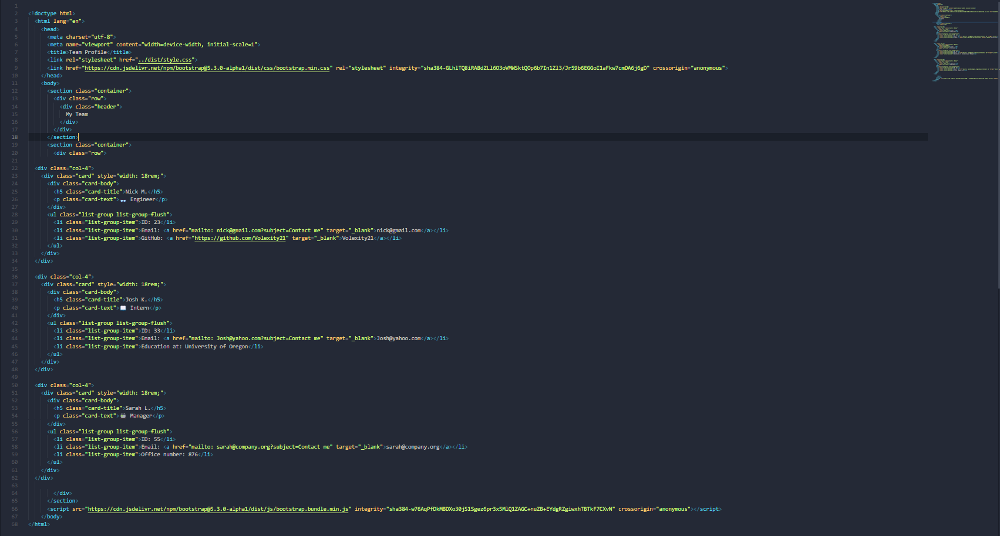

# Team Profile Generator
[]
  
[MIT License](https://opensource.org/licenses/MIT)
## Description

This application creates a webpage that stores each individual's role in a development team in a clear and informative fashion. It allows you to view each individual's name, email, and identification number while also providing GitHub profiles for Engineers, education from Interns, and office numbers from Managers. 

## Table of Contents

* [Installation](#installation)

* [Usage](#usage)
    
* [License](#license)

* [Contributing](#contributing)

* [Tests](#tests)

* [Questions](#questions)

## Installation

To install the necessary dependencies, run the command nmp i.

## Usage

You will be prompted a series of questions about basic information for each team member and their role in the development team. There will be a point where you will be asked if you would like to add another team member or create your Team Profile. This cycle will continue until you have added all team members and want to create your landing page. This should be used to organize your team members on start up, if there are any adjustments, and promotions. 

[Link to a walkthrough video](https://youtu.be/NRw4rQCAkok)

## License

MIT License

Copyright (C) 2023 <Volexity21>

Permission is hereby granted, free of charge, to any person obtaining a copy of this software and associated documentation files (the "Software"), to deal in the Software without restriction, including without limitation the rights to use, copy, modify, merge, publish, distribute, sublicense, and/or sell copies of the Software, and to permit persons to whom the Software is furnished to do so, subject to the following conditions:

The above copyright notice and this permission notice shall be included in all copies or substantial portions of the Software.

THE SOFTWARE IS PROVIDED "AS IS", WITHOUT WARRANTY OF ANY KIND, EXPRESS OR IMPLIED, INCLUDING BUT NOT LIMITED TO THE WARRANTIES OF MERCHANTABILITY, FITNESS FOR A PARTICULAR PURPOSE AND NONINFRINGEMENT. IN NO EVENT SHALL THE AUTHORS OR COPYRIGHT HOLDERS BE LIABLE FOR ANY CLAIM, DAMAGES OR OTHER LIABILITY, WHETHER IN AN ACTION OF CONTRACT, TORT OR OTHERWISE, ARISING FROM, OUT OF OR IN CONNECTION WITH THE SOFTWARE OR THE USE OR OTHER DEALINGS IN THE SOFTWARE.

## Contributing

Should there be any questions or ideas for improvement, please reach out to me via email."

## Tests

To run all tests, run the command npm t.

## Questions

[Feel free to join me through past and future projects!](https://github.com/Morralytics)

With further questions you can reach me via email at:

nicholasmorris2599@gmail.com
